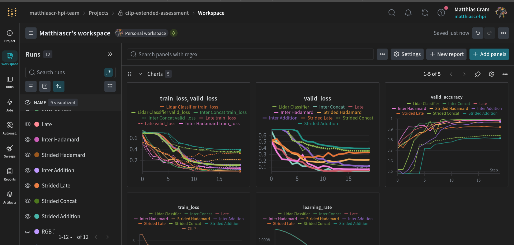

# CILP Assessment: Multimodal Learning

This is an Assignment in the Seminar "Applied Hands-On Computer Vision" at HPI. It is about multimodal models, different fusion strategies, and contrastive learning.

## Data Setup

The dataset consists of cubes and spheres each having an rgb image and matching data from a LiDAR sensor. From the original dataset ([kaggle](https://www.kaggle.com/datasets/andandand/cubes-and-spheres-lidar-and-rgb)) consisting of 9999 cubes and 9999 spheres I created a subset of 1000 cubes and 1000 spheres and uploaded it as a grouped fiftyone dataset on huggingface. All notebooks will start by loading this huggingface dataset. In the first notebook I explain how I created this subset and how to use it.

https://huggingface.co/datasets/MatthiasCr/multimodal-shapes-subset

## W&B Project

All training in this repo is logged to this public W&B project:

https://wandb.ai/matthiascr-hpi-team/cilp-extended-assessment/overview



## Running on Google Colab

The notebooks can be executed in google colab. 

- Open a notebook in colab by navigating to it on github and then change the url from github.com to githubtocolab.com.

- Setting a `HF_TOKEN=<your_huggingface_token>` as Colab Secret so the notbook can load data from huggingface. 

- Execute this cell which is the first in every notebook:

```python
import sys

# Colab-only setup
if "google.colab" in sys.modules:
    print("Running in Google Colab. Setting up repo")

    !git clone https://github.com/MatthiasCr/Computer-Vision-Assignment-2.git
    %cd Computer-Vision-Assignment-2
    !pip install -r requirements.txt
    %cd notebooks
```

This clones the repo and sets it as working directory. Now local imports from the `src` module and all relative paths used inside the notebooks will work. It also installs all necessary python packages.

**W&B Setup** (only for notebooks 2-4)

- Open the file /content/Computer-Vision-Assignment-2/src/training.py and set the constants `WANDB_TEAM_NAME` to your W&B team name and `WANDB_PROJECT_NAME` to a name for a (new) project

- Execute the cell that contains `!wandb login` and insert your W&B token

## Summary of Results

### Comparison of Fusion Architectures:

Fusion models with `MaxPool2D` downsampling (details in notebook `02_fusion_comparison`):

| Metric | Late Fusion | Intermediate (Cat) | Intermediate (Add) | Intermediate (Had) |
| --- | --- | --- | --- | --- |
| Valid Loss | 0.039 | 0.032 | 0.119 | 0.070 |
| Valid Accuracy | 0.987 | 0.992 | 0.971 | 0.984 |
| Parameter Count | 1,415,051 | 914,201 | 824,201 | 824,201 |
| Train Time (s) | 22.17 | 25.71 | 24.38 | 24.76 |
| GPU Memory (MB) | 601 | 773 | 775 | 777 |

Fusion models with strided convolutions as downsampling. In brackets is the difference to the corresponding run with MaxPool (details in notebook `03_strided_conv_ablation`):

| Metric | Strided Late | Strided Concat | Strided Addition | Strided Hadamard |
| --- | --- | --- | --- | --- |
| Valid Loss | 0.254 (+0.215) | 0.357 (+0.325) | 0.395 (+0.276) | 0.179 (+0.109) |
| Valid Accuracy | 0.929 (-0.058) | 0.841 (-0.151) | 0.820 (-0.151) | 0.971 (-0.013) |
| Parameter Count | 1,415,051 (=) | 914,201 (=) | 824,201 (=) | 824,201 (=) |
| Train Time (s) | 16.15 (-6.02) | 15.25 (-9.92) | 14.97 (-9.41) | 14.82 (-9.94) |
| GPU Memory (MB) | 779 (+178) | 779 (+6) | 779 (+4) | 779 (+2) |

### CILP Model

CILP similarity matrix:


